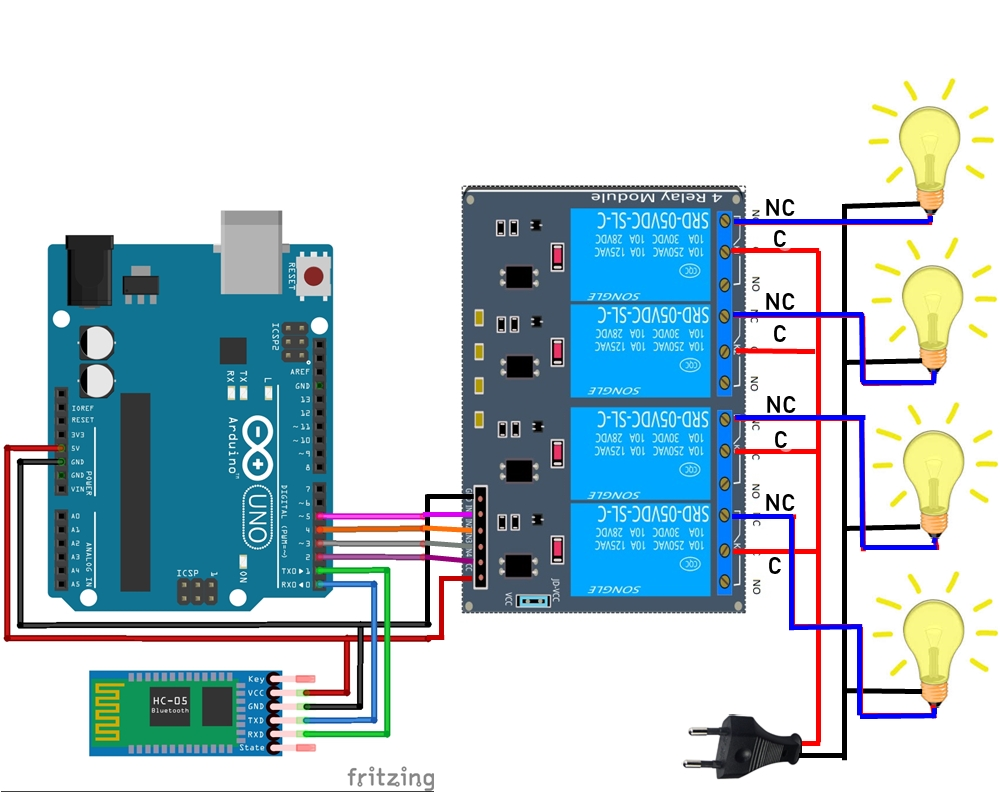

# INO-Arduino-Bluetooth-Lamp-Control
Kontrol Lampu Menggunakan Smartphone Android Via Koneksi Bluetooth. 

**Aplikasi Android yang Digunakan: [Conar_LED™](https://github.com/Drumber/RemoteLight/releases) by Wynz** 

## Bahan-bahan Utama
- Arduino Uno
- Modul Bluetooth Hc-05
- Modul Relay 4 Channel

## Pin Config Arduino
### 🔻 Arduino 👉 Relay 4 Ch
- 5 => IN1
- 4 => IN2
- 3 => IN3
- 2 => IN4

### 🔻 Arduino 👉 Bluetooth HC05
- 0 RX => TXD
- 1 TX => RXD

## Gambar Skematik
 
